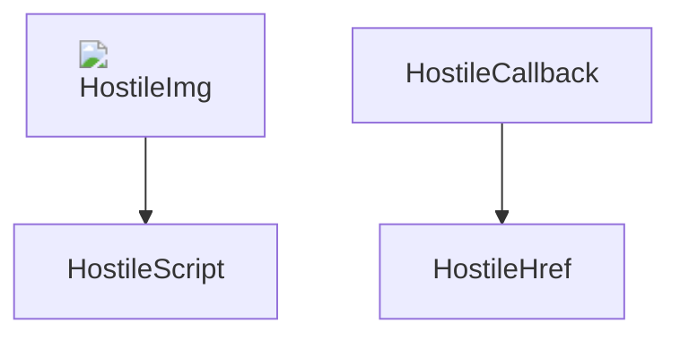
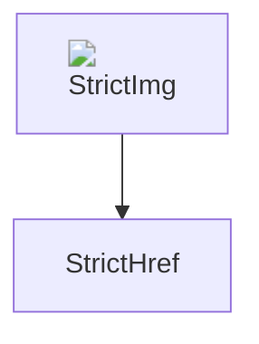

# Hostile diagram fixture

Hostile text before.

```mermaid
%%{init: {"securityLevel":"loose"}}%%
flowchart TD
  HOSTA["<img src=x onerror=window.__pwned='img-loose'> HostileImg"] --> HOSTB["<script>window.__pwned='script-loose'</script> HostileScript"]
  HOSTC[HostileCallback] --> HOSTD[HostileHref]
  click HOSTC call pwn()
  click HOSTD href "javascript:window.__pwned='href-loose'"
  click HOSTA "javascript:window.__pwned='link-loose'"
```

```mermaid
flowchart TD
  STRICTA["<img src=x onerror=window.__pwned='img-strict'> StrictImg"] --> STRICTB[StrictHref]
  click STRICTB href "javascript:window.__pwned='href-strict'"
  click STRICTA call pwn()
```

A normal [outside link](https://example.com/outside) after the diagrams.
