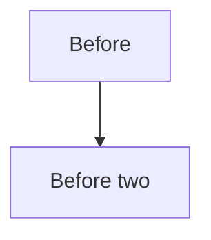
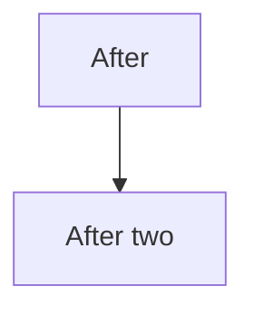

# Mermaid error fixture

Text before the diagrams.

```mermaid
flowchart TD
  ERRBEFORE[Before] --> ERRBEFORE2[Before two]
```

```mermaid
flowchart TD
  BROKENNODE[unclosed --> ((( ]]] ---
```

```mermaid
flowchart TD
  ERRAFTER[After] --> ERRAFTER2[After two]
```

Text after the diagrams.
