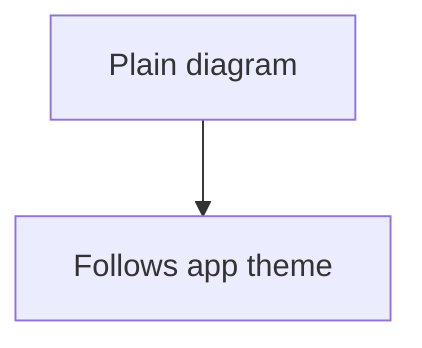
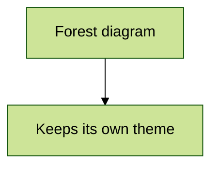

# Theme fixture

```mermaid
flowchart TD
  THEMEPLAIN[Plain diagram] --> THEMEPLAIN2[Follows app theme]
```

```mermaid
%%{init: {"theme":"forest"}}%%
flowchart TD
  THEMEFOREST[Forest diagram] --> THEMEFOREST2[Keeps its own theme]
```
