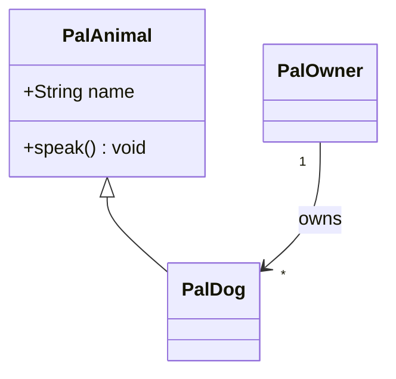

# Class palette fixture

```mermaid
classDiagram
  class PalAnimal {
    +String name
    +speak() void
  }
  class PalDog
  class PalOwner
  PalAnimal <|-- PalDog
  PalOwner "1" --> "*" PalDog : owns
```
