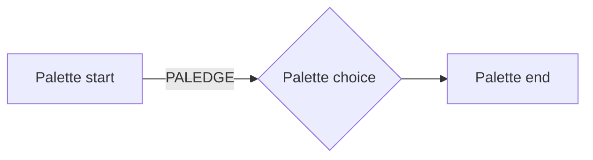
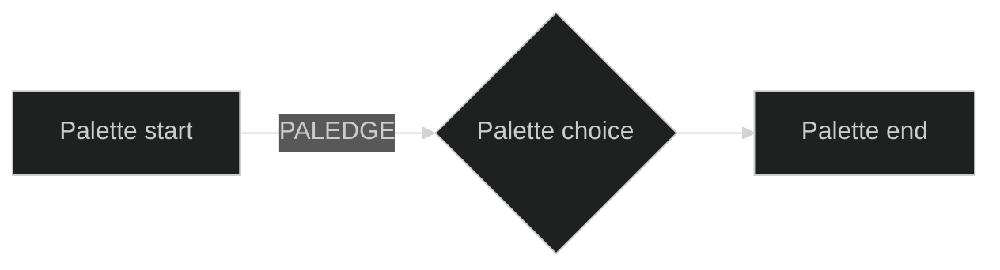

# Flowchart palette fixture

The first diagram is plain and takes the app palette. The two after it pin
Mermaid's built-in `dark` and `default` themes: they are the oracles AC1 and
AC2 compare the plain render against.

