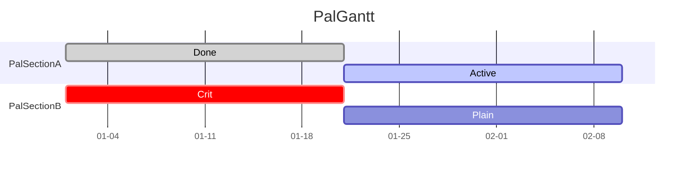

# Gantt palette fixture

Bars are long and labels short so every task label sits inside its bar.

```mermaid
gantt
  title PalGantt
  dateFormat YYYY-MM-DD
  axisFormat %m-%d
  todayMarker off
  section PalSectionA
    Done   :done, g1, 2026-01-01, 20d
    Active :active, g2, after g1, 20d
  section PalSectionB
    Crit   :crit, g3, 2026-01-01, 20d
    Plain  :g4, after g3, 20d
```
