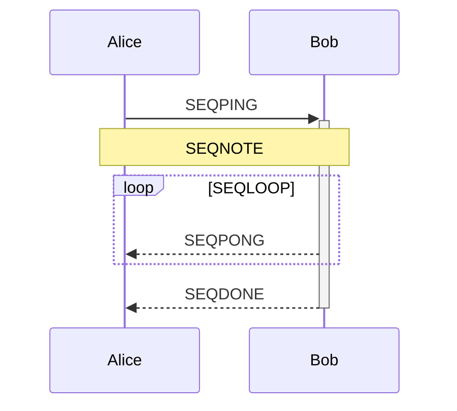

# Sequence palette fixture

```mermaid
sequenceDiagram
  participant Alice
  participant Bob
  Alice->>+Bob: SEQPING
  Note over Alice,Bob: SEQNOTE
  loop SEQLOOP
    Bob-->>Alice: SEQPONG
  end
  Bob-->>-Alice: SEQDONE
```
