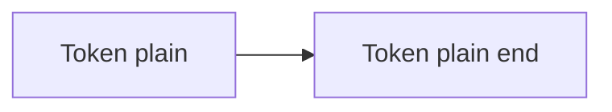
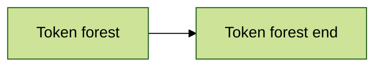

# Token error fixture

```mermaid
flowchart LR
  TOKPLAIN[Token plain] --> TOKPLAIN2[Token plain end]
```

```mermaid
%%{init: {"theme":"forest"}}%%
flowchart LR
  TOKFOREST[Token forest] --> TOKFOREST2[Token forest end]
```
